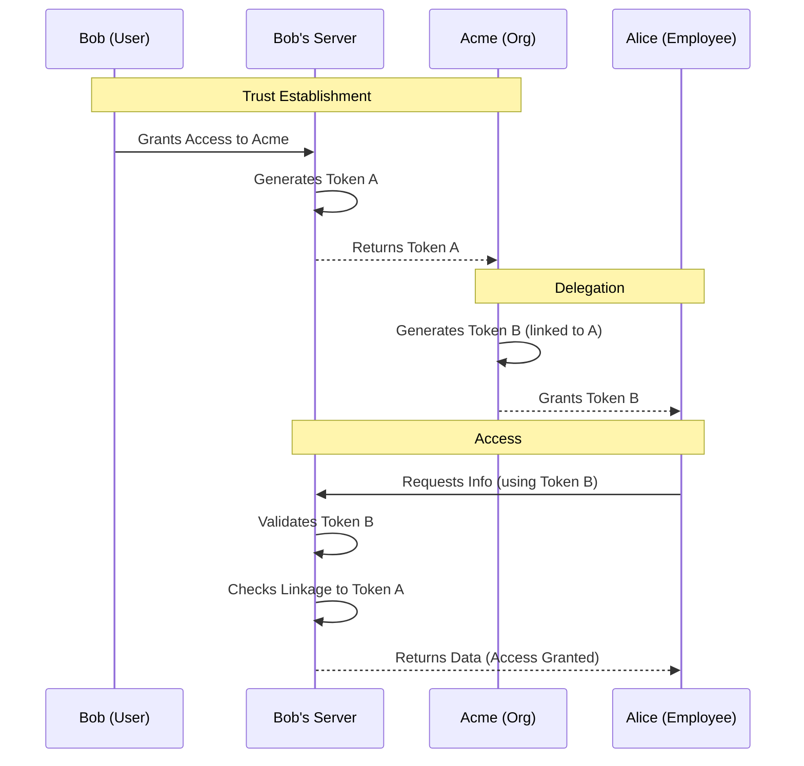

# HTIDP API Navigation and Discovery Flow

This document outlines the discovery process for clients to find and interact with the HTIDP API, adhering to HATEOAS principles.

## 1. Initial Discovery

The entry point for any HTIDP server is a well-known URI.

### Step 1: `GET /.well-known/htidp`

A client initiates discovery by making a GET request to the `/.well-known/htidp` path on the host.

*   **Request:** `GET https://alice.com/.well-known/htidp`
*   **Response:** A JSON object containing the root URL for the API.

```json
{
  "api_root": "https://alice.com/api/v1"
}
```

## 2. API Root Navigation

The client uses the `api_root` URL from the previous step to discover available actions.

### Step 2: `GET [api_root]`

The client makes a GET request to the `api_root` URL.

*   **Request:** `GET https://alice.com/api/v1`
*   **Response:** A JSON object containing a `links` array. This array tells the client where to find core resources like `identity` and where to initiate a `handshake`.

```json
{
  "links": [
    {
      "rel": "self",
      "href": "https://alice.com/api/v1"
    },
    {
      "rel": "identity",
      "href": "https://alice.com/api/v1/identity",
      "methods": ["GET"]
    },
    {
      "rel": "handshake",
      "href": "https://alice.com/api/v1/handshake",
      "methods": ["POST"]
    }
  ]
}
```

The client now knows it can `GET` the `identity` URL to retrieve the public profile and `POST` to the `handshake` URL to start a connection request.

## 3. Delegation Extension

HTIDP allows organizations to delegate trust to their members (e.g., employees). This is accomplished by adding a special link to the organization's API root.

### How it Works

An organization (e.g., `acme.com`) includes a link with a `rel` value of `https://htidp.org/ext/delegation#delegate` in its API root response. This link points to a specific handshake endpoint for delegated requests.

*   **Request:** `GET https://acme.com/api/v1`
*   **Response from Organization's Server:**

```json
{
  "links": [
    {
      "rel": "self",
      "href": "https://acme.com/api/v1"
    },
    {
      "rel": "identity",
      "href": "https://acme.com/api/v1/identity",
      "methods": ["GET"]
    },
    {
      "rel": "handshake",
      "href": "https://acme.com/api/v1/handshake",
      "methods": ["POST"]
    },
    {
      "rel": "https://htidp.org/ext/delegation#delegate",
      "href": "https://acme.com/api/v1/delegated-handshake",
      "methods": ["POST"]
    }
  ]
}
```

An employee's client, upon discovering this link, can POST a standard Handshake Request to the `delegated-handshake` URL. The server at `acme.com` can then apply special logic, such as verifying the employee's email domain or checking against an internal directory, before accepting the connection and granting access to resources inherited from the organization.

## 4. Visual Overview

### The "HATEOAS Ladder"

This diagram illustrates the client's journey from the initial well-known endpoint to obtaining an access token.

```mermaid
graph TD
    Step1[/.well-known/htidp] -->|Returns API Root URL| Step2[API Root]
    Step2 -->|Returns Links| Step3[Handshake URL]
    Step3 -->|POST Request| Step4[Poll Status]
    Step4 -->|Status: Accepted| Step5[Access Token]

    style Step1 fill:#f9f,stroke:#333,stroke-width:2px
    style Step5 fill:#bbf,stroke:#333,stroke-width:2px
```

### The Delegation Chain

This sequence demonstrates how trust is delegated from an organization to a member.

